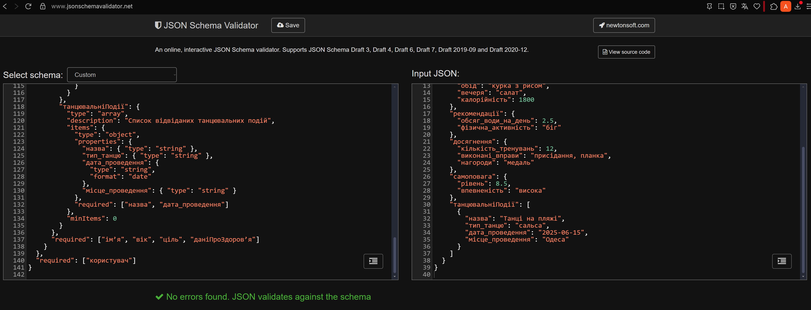

### Фізична схема БД

#### 🔹 Реляційна модель (SQL)

Файл містить SQL-команди для створення таблиць, ключів та обмежень:
- [DataSchema.sql](./DataSchema.sql)

#### 🔹 JSON-модель (JSON Schema)

Файл містить повну ієрархічну JSON-схему:
- [DataSchema.json](./DataSchema.json)

#### Перевірка JSON Schema:

