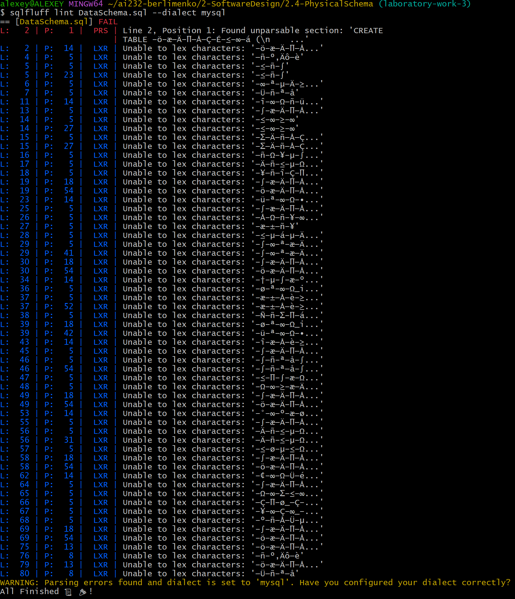

### Перевірка відповідності програмного коду нормам кодування

Після первинної перевірки SQL-схеми було зафіксовано помилки кодування та синтаксису.

Потім було створено файл `DataSchemaModified.sql` для вирішення зафіксованих проблем:
виправлено імена, стиль, синтаксис та зарезервовані слова.

Після повторної перевірки схема успішно пройшла всі вимоги linting.
Результати зафіксовано: 

