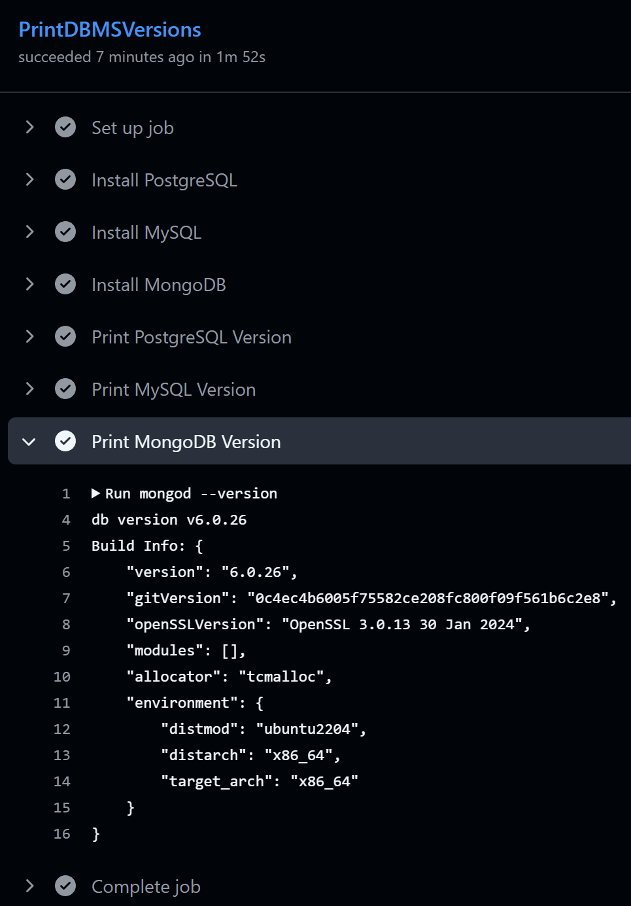
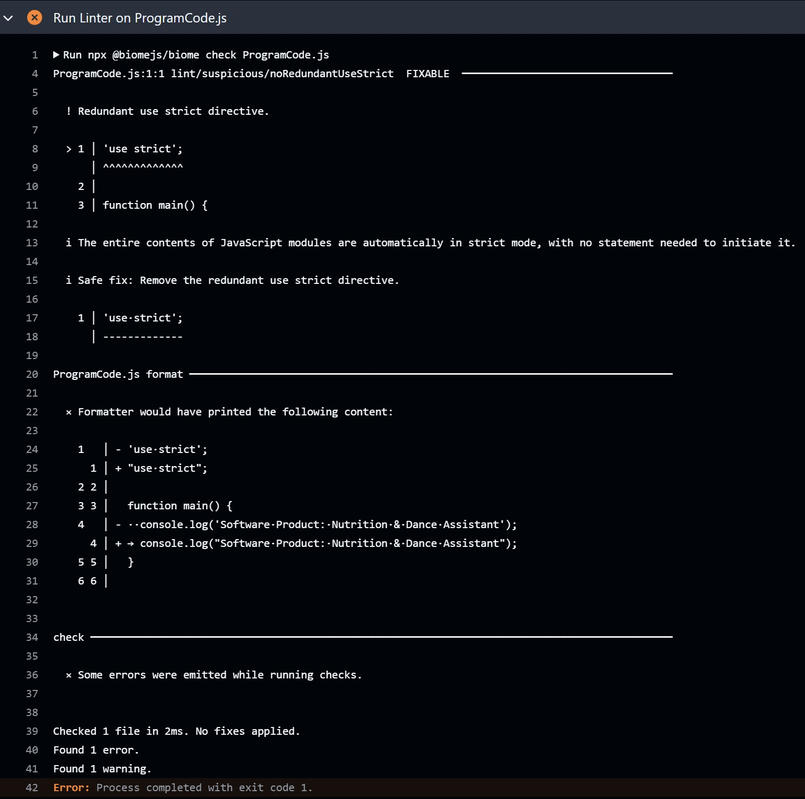
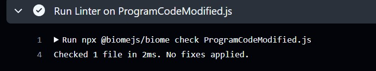

### Автоматизована перевірка норм кодування програмного коду

#### Успішне виконання GitHub Actions workflow

#### Початкова перевірка

#### Перевірка після внесення змін

#### Результат перевірки лінтера для файлу ProgramCode.js. Інструмент виявив помилку — зайву директиву 'use strict'. Лінтер рекомендує її видалити.

#### Результат перевірки лінтера для файлу ProgramCodeModified.js. Зараз помилок не виявленно — код відповідає вимогам кодування. 

