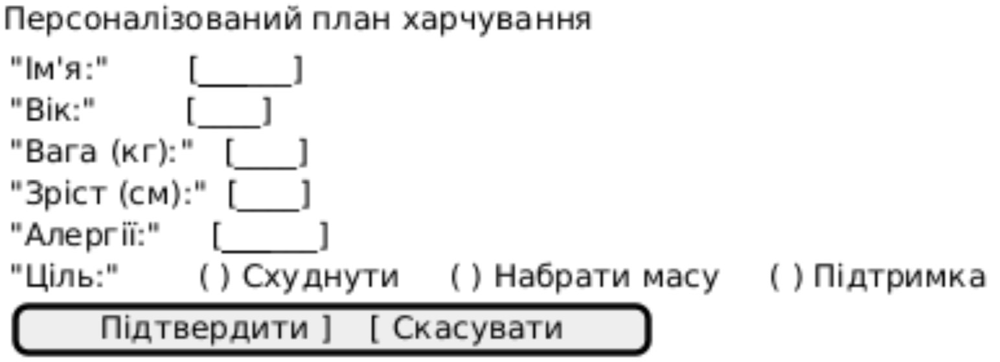
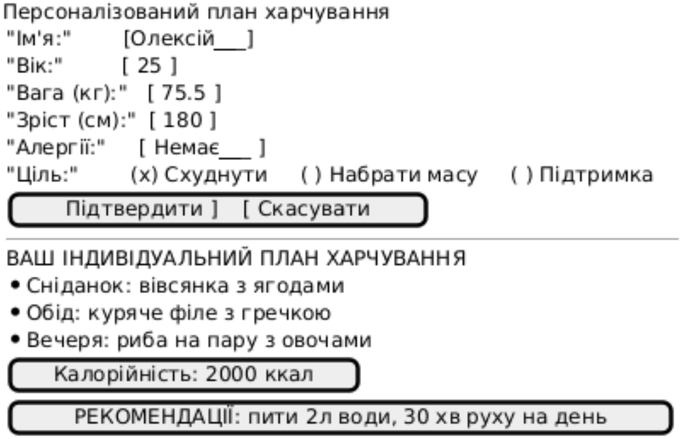
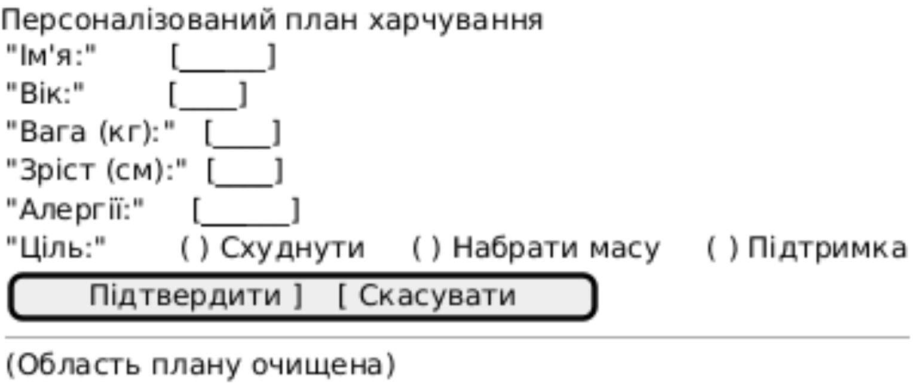

# Тестові сценарії для NFR1.1 — Графічний інтерфейс введення даних

## Опис вимоги

NFR1.1: Інтерфейс введення даних про здоров’я користувача (ім’я, вік, вага, зріст, алергії, ціль) має відповідати заданому макету: поля вводу, елементи вибору цілі, кнопки підтвердження/скасування, область відображення згенерованого плану та калорійності.

## Тестові сценарії для NFR1.1

| NFR ID | Test Case ID | Опис кроків тестового сценарію | Опис очікуваних результатів |
| :--- | :--- | :--- | :--- |
| NFR1.1 | TC1.1 | **Початкові умови:** відсутні.  **Кроки сценарію:** 1) Запустити застосунок. 2) Відкрити екран «Персоналізований план харчування». | **Екранна форма:**  |
| NFR1.1 | TC1.2 | **Початкові умови:** успішно пройдено TC1.1.  **Кроки сценарію:** 1) Усі поля вводу заповнені коректними значеннями (ім’я, вік, вага, зріст, алергії). 2) У блоці «Ціль» обрано одну з опцій «Схуднути» / «Набрати масу» / «Підтримка». 3) Натиснути кнопку «Підтвердити». | **Екранна форма:**  |
| NFR1.1 | TC1.3 | **Початкові умови:** успішно пройдено TC1.1, усі поля заповнені, згенерований план відображається.  **Кроки сценарію:** 1) Натиснути кнопку «Скасувати». | **Екранна форма:**  |
