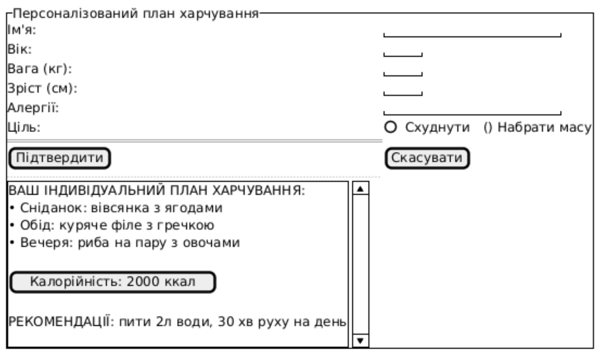

# Тестові сценарії для NFR1.1 — Графічний інтерфейс введення даних

## Опис вимоги
NFR1.1: Інтерфейс введення даних про здоров’я користувача (вага, зріст, вік, ціль) має відповідати заданому макету: поля вводу, випадаючі списки, кнопки підтвердження/скасування, візуальне оформлення.

